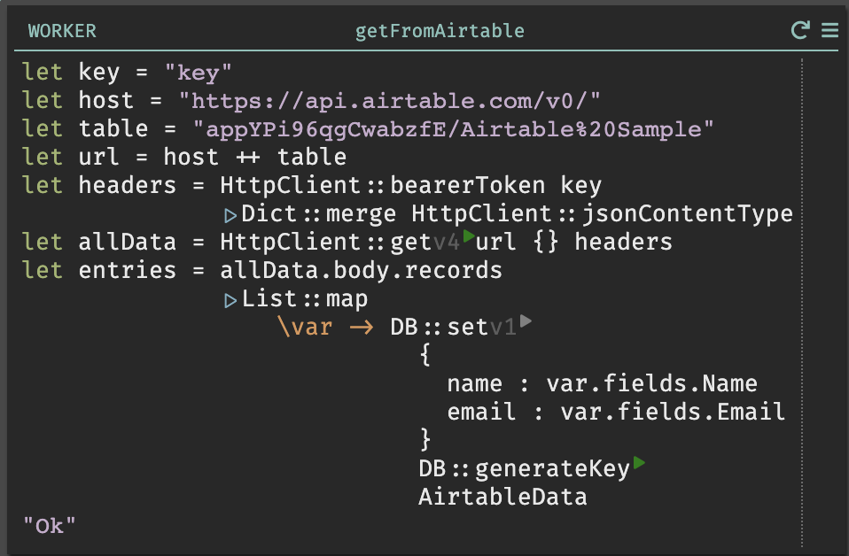
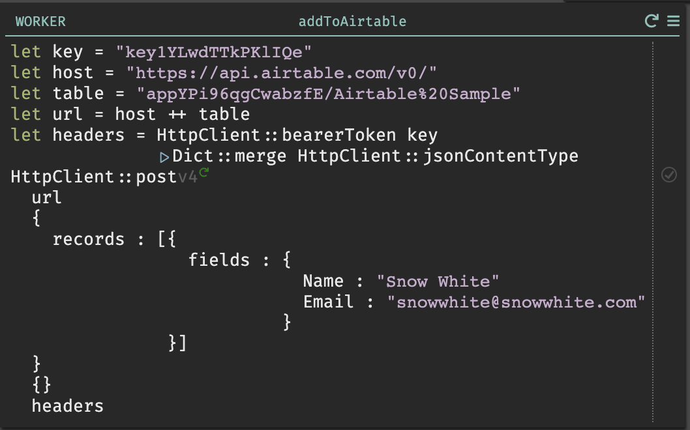
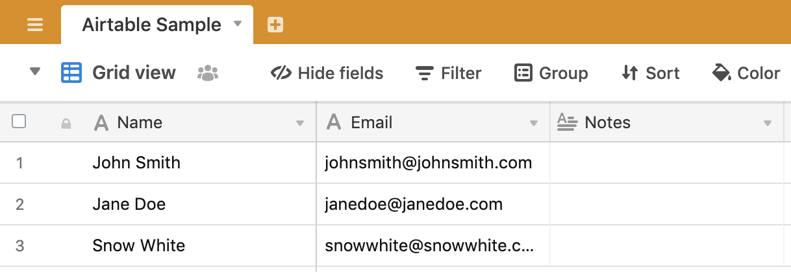
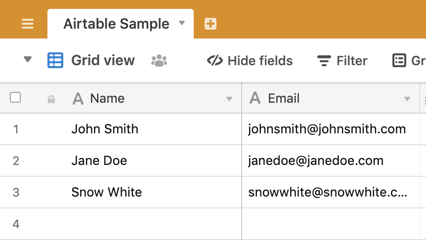

This guide will walk you through how you can use Airtable’s API to add or update information in Airtable. An Airtable sample canvas is available [here](https://darklang.com/a/sample-airtable).

## What You Need

- An Airtable account with a Base and table(s) already created. You will likely want to plan what columns you will want to have in your Airtable ahead of time.
- Access to the [Airtable API documentation](https://airtable.com/api).
- Access to your [Airtable API key](https://airtable.com/account).

## Sending Information From Airtable to Dark

- Create a background worker to send data to Airtable.
- Add your API key, the Airtable API, and the Airtable table you’re going to use. An Airtable table looks something like this: appYPi96qgCwabzfE/Airtable%20Sample
- We’ll access the data over Airtable’s JSON API. In Dark, we make HTTP calls using HttpClient::get.
    - Headers in Dark are passed in a dict, but we have convenience functions for them, like HttpClient::bearerToken and HttpClient::jsonContentType. You can inspect the headers by clicking on ‘header’ to see it’s live value.
    - To test out the API call, press the Play button.
- If you only want one field, like the Name field, you will want to add “Record Type” to your table. To get the exact string for this, reference the Retrieve a Record section of your [Airtable API documentation](https://airtable.com/api).

## Putting Information From Airtable into a Dark Datastore

1. Create a Dark datastore and populate it with the fields you need.

2. Next iterate through the results - held in allData.body.records, and add them to the DB using DB::set.

3. Click the play button - your datastore will update.

## Sending Information From Dark to Airtable

- Create a background worker to send data to Airtable.
- Add your API key, the Airtable API, and the Airtable table you’re going to use. An Airtable table looks something like this: appYPi96qgCwabzfE/Airtable%20Sample
- We’ll access the data over Airtable’s JSON API. In Dark, we make HTTP calls using HttpClient::get.
    - Headers in Dark are passed in a dict, but we have convenience functions for them, like HttpClient::bearerToken and HttpClient::jsonContentType. You can inspect the headers by clicking on ‘header’ to see it’s live value.
    - To test out the API call, press the Play button.
- Create your HttpClient::post call. Note that to add a new entry, you will need to format your data using “records” and “fields.” You can click the Play button next to post to manually populate your Airtable to check if its working. Here, I’ve added one entry, but you can replace the strings with variables to add data however you would like.

# Troubleshooting

- Field/column names in Airtable are case sensitive, so make sure your cases match everywhere.
- Airtable will send over completely empty entries, so if it looks like you’re getting too much data, verify that you don’t have an extra row in your table, like this one:

