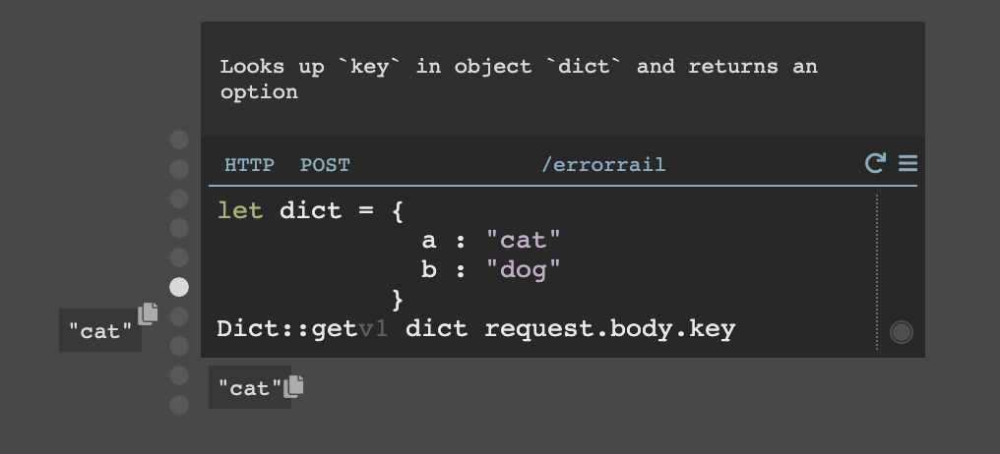
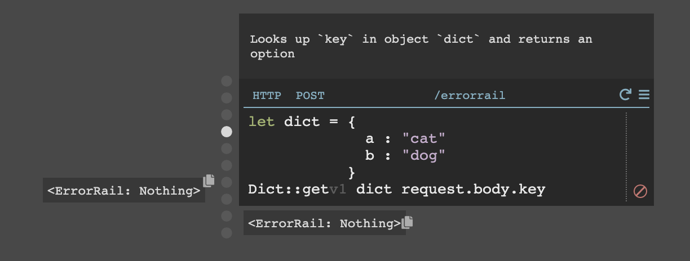
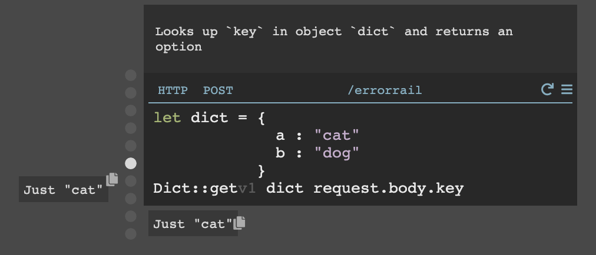
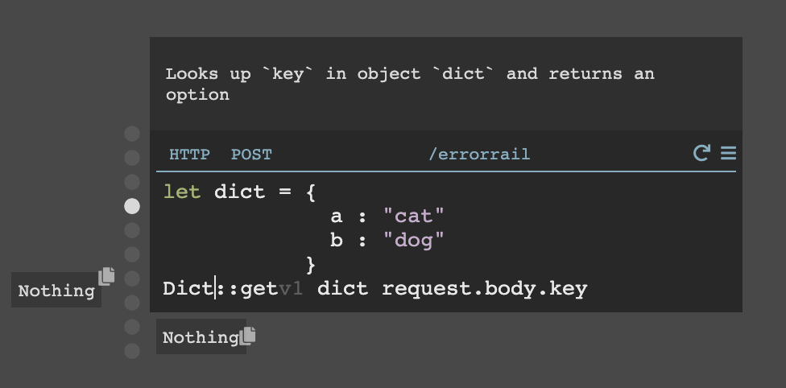
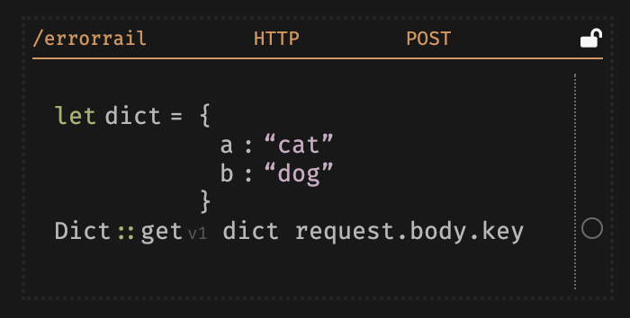
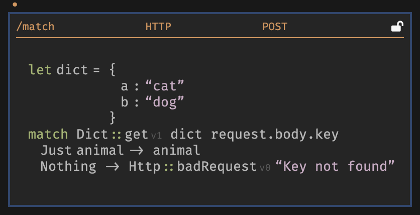

The Dark code you write in your handlers is available as soon as you type (deployless). We have a number of built-in features to support this style of writing, as well as dealing with errors.

## Incomplete Code

Dark is expression based. When you see "incomplete code", it means that your program isn't complete - that is, an expression hasn't been filled in. Once you've filled in every expression in the associated code block, the problem will be resolved.

**Example:** Here we've bound a string to the new variable `msg` within an empty block, using a `let`. Since the body of the `let` is empty, the expression as a whole is incomplete. To resolve the problem, fill in the body of the `let` (for example, with `msg`).

**Example:** Here we left the query parameter blank in a call to `HttpClient::get`:

We need to fill in all parameters, here we can use `{}`.

When something is incomplete, it will be shown with a red underline. An expression may be incomplete even if it seems fine: this is because something it depends on is incomplete. For example, in the case below we are returning `var` but never defined it:

In these cases, we provide a link to the source of the incomplete. Click on "click to locate source" and it will take you to the first blank that has propagated until the result you are looking for.

## Type errors

When you see "invalid code", it means that your program is complete but has issues (which are almost always type error). The error message should have enough . Carefully read the message to see what's wrong.

**Example:**

Here we tried to use **DB::set** with an Int for the `key` parameter, even though `key` needs to be a string.

To resolve this problem, we can use a string instead. "123" or 123 |> **toString** will both work.

## Error Rail

The error rail allows you to keep writing code along the “happy path,” without stopping to handle errors. This is based on [Railway Oriented Programming](https://medium.com/darklang/real-problems-with-functional-languages-efe668c5264a).

The idea is that when you call a function which might not succeed, you can keep going. For example, if you try to look up a value in a dictionary or database, we don't make you immediately handle the error case, instead we "put the value on the error rail".

There are two types that go to the error rail: Result and Option (more below). You can tell if an expression returns a result or option from looking at the docstring. Result and Option types both have a "good" value, indicating that the function succeeded, and a "bad" value that indicates that the function failed. In the case of a "good" value, you can just ignore the result and option type - we unwrap them automatically. In the case of a "bad" value, the execution will end (similar to throwing an exception that isn't caught).

Here's a success case: Dark automatically unwraps the Option returned by `Dict::get`, so the result is just "cat".

In an error case, you will see `Nothing` appear on the rail (`Nothing` is the error value of an Option):

**When you are ready to handle error cases,** you remove them from the rail by using the editor command `take-function-off-rail` (open the Command palette by hitting Option-x or Alt-x).

You can see this sample [here](https://darklang.com/a/sample-match).

The following types will have their values unwrapped in the happy case, and wrapped inside the error rail in the error case.

| Type        | Happy Case | Error Case    |
| ----------- | ---------- | ------------- |
| Result type | OK val     | Error message |
| Option type | Just val   | Nothing       |

### Handling errors

Using the error rail, we'll automatically handle errors, returning a 500 error for bad results and a 404 for bad Options. This allows you to have nice clean code:

Of course, while that's nice at the start, as you start to expand your Dark application, you will probably want to handle the errors directly. Here's how you would write error handling code:

The command **:take-function-off-rail** will stop the value being sent to the rail, and you get the unwrapped result.

If you accidentally take a function off the error rail, you can add it back by selecting the same function, and using option-x (or alt-x) to select the command **:put-function-on-rail**.
