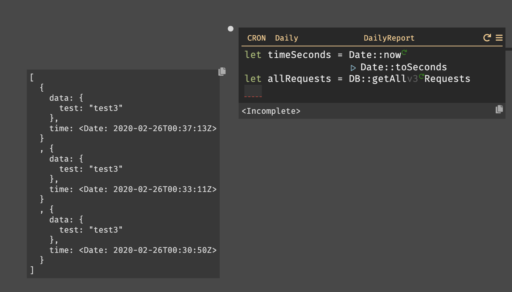
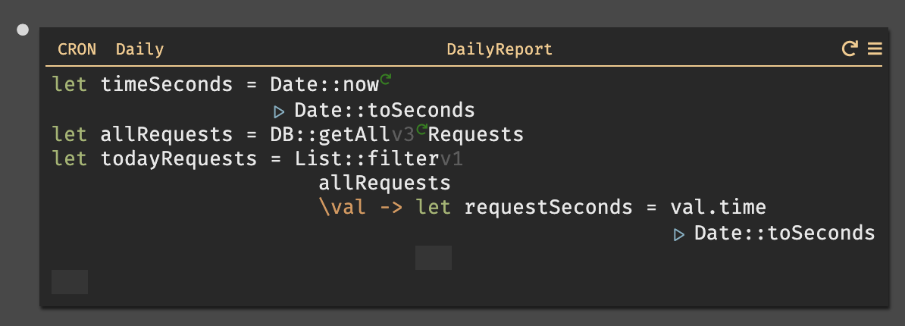
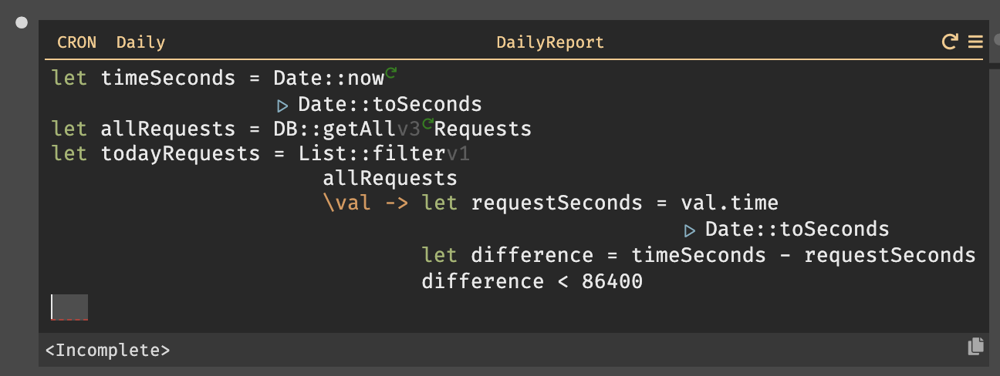
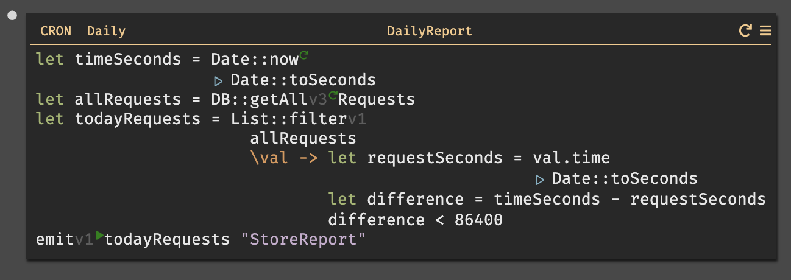

Now that we're storing requests, we can use a scheduled job (CRON) to create a report of all requests per day.

1. Hit the + button (or use the omnibox) to create a new CRON. Set it to run daily, and with the name DailyReport.

2. To know if something was today, we'll have to compare to the current time. Create a variable `timeSeconds` and set it equal to `Date::now`. Run the `Date::now` function to see the current time and so a value will be available. 
For comparison, we'll need the time in seconds, and you can pipe to the `Date::toSeconds` function. (Note: to open the pipeline type `|>` after the `Date::now` Function).

3. Now, we'll need to get all of the requests so we can filter to today's. Set `allRequests` to `Db::getAll Requests`. Running the function will show you the existing requests.

4. To see only today's requests, we'll use `List::filter`. `List::filter` takes two parameters - the list to filter (in this case `allRequests`) and the anonymous function that determines if it should be returned or not. `List::filter` is similar to `List::map` and the concept is explained in more detail [here](https://darklang.github.io/docs/functional-aspects).

5. For our anonymous function, we want to see if a request occurred today. First, we should convert the time of the request into seconds. This is similar to the first line of the CRON.

6. Then, we'll want to calculate the difference to the current time. Once we know the difference we can decide to compare based on if it happened today (in the last 86,400 seconds).

7. To see this work, it's helpful to have a recent request. If you paused in the tutorial, re-run the `HTTPClient::Post` function from the REPL. Then, when you place your cursor in `todayRequests` or `List::filter` you should see the list of requests from the last 24 hours.

7. We'll need a unique key for each object. In this case, by typing db, we get the built in db::GenerateKey function.

8. Finally, we'll emit today's requests to a background worker, using the emit keyword. Emit takes two parameters, and in this case we're sending `todayRequests` to a not yet created worker named `StoreReport`.

9. To have our first report run, hit the "replay" button in the upper right of the CRON. This will create a 404 in the lefthand side bar for the Worker `StoreReport`.
