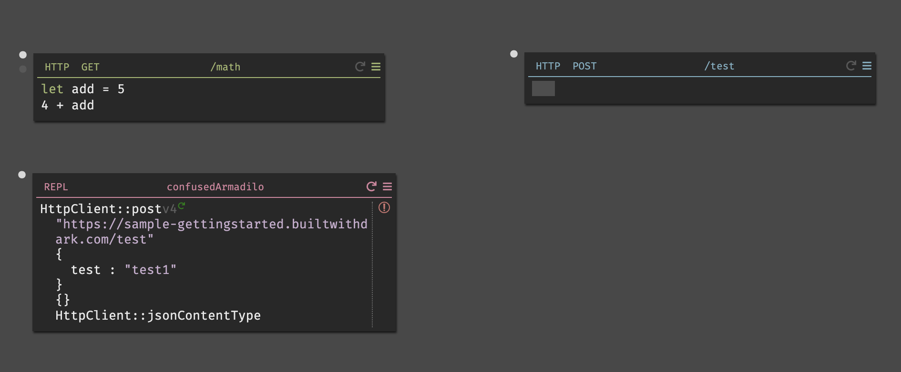
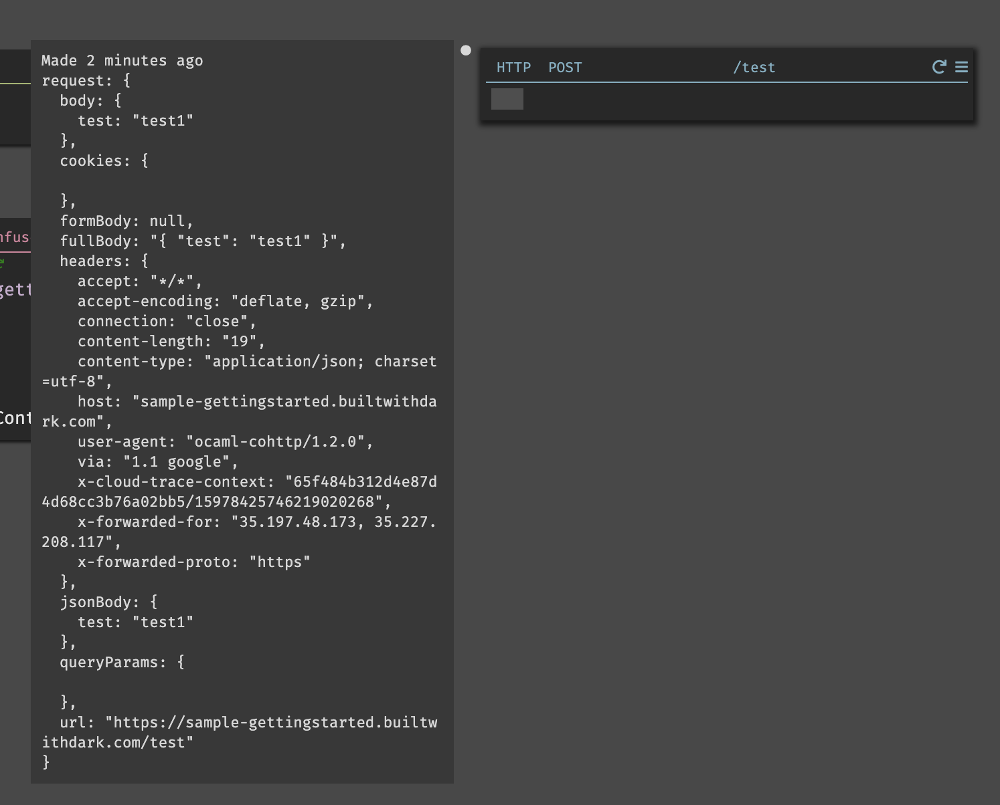
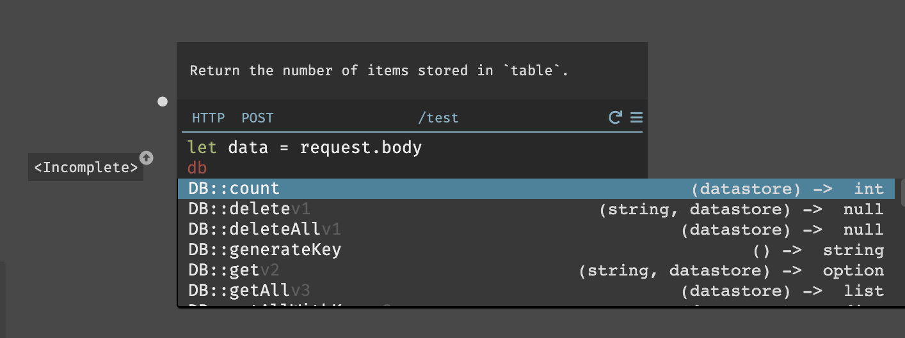
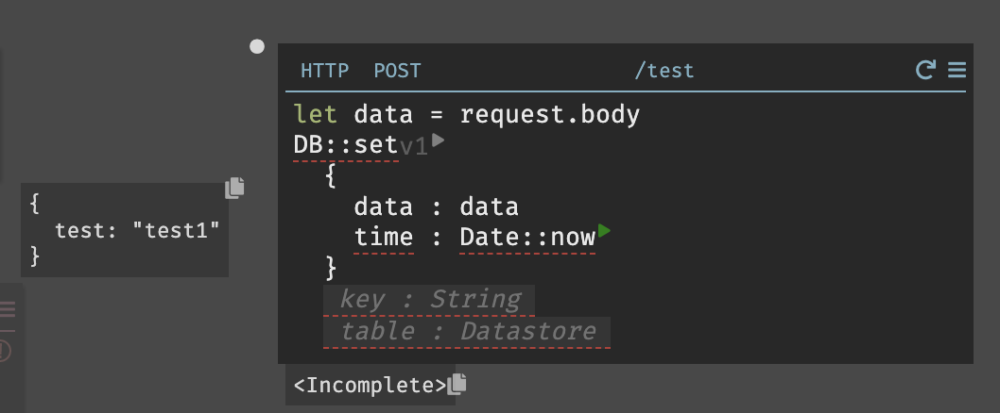
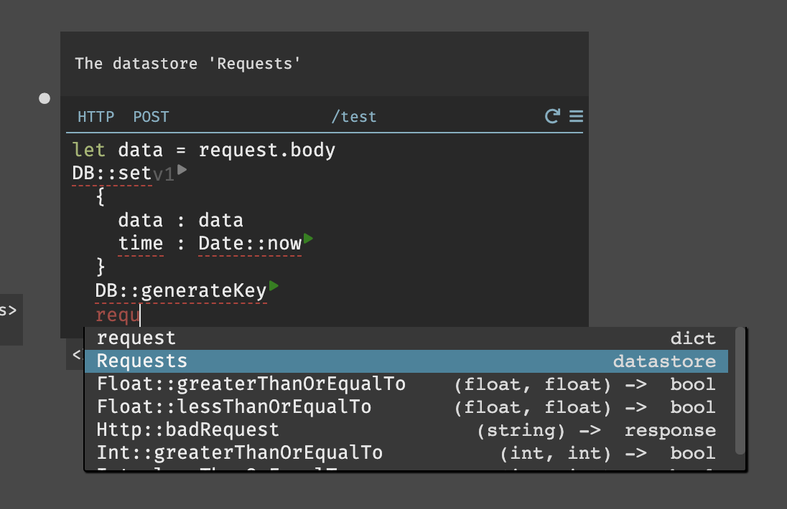
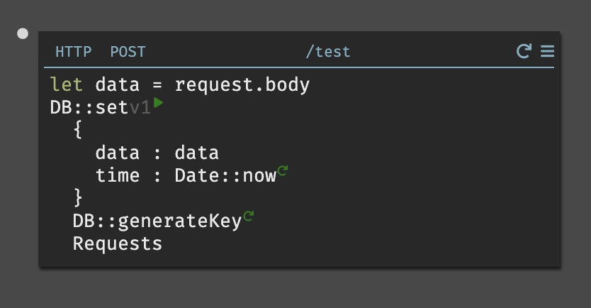

We can use the trace of that HTTP request to build the endpoint. This is Trace Driven Development.

1. Hit the + button in the side bar to create the HTTP endpoint. The verb (POST) and route (/test) will be set for you.

2. Hover over the white dot on the left hand side. Here, you'll see the full body of the incoming trace from when you posted to the endpoint from the REPL, including the body.

3. Let's work with the request directly and save the incoming body to a record by typing `let data = request.body` again. The autocomplete will assist with the fieldnames.

4. Let's put this in a datastore. Like our HttpClient library, typing "DB" in the blank will pull up all datastore functions.

In this case, we want db::set, which takes three parameters.

5. Now let's make our datastore. From the sidebar or the omnibox, create a new datastore called "requests" and give it two field names.

All datastores in Dark are key-value based and use keys as unique identifiers for the record. For instance, a possible set of records with keys in the above datastore would look like this:

    {
      key1: {
              data: {
                      test: "test2"
                    },
              time: <Date: 2020-02-11T18:54:39Z>
            },
      key2: {
              data: {
                      test: "test1"
                    },
              time: <Date: 2020-02-11T18:54:43Z>
            }
    }

6. Now that we have a datastore, let's finish our post endpoint.

The first parameter is the record we're inserting. This will match our schema of date & time. In Dark, all fields must be included for DB::set. We'll insert our data from above (seeing the live value to the left) and the Date::now function to get a time.

7. We'll need a unique key for each object. In this case, by typing db, we get the built in db::GenerateKey function.

8. Lastly, we'll use the autocomplete to add our datastore, Requests.

9. To run the DB::set operation on our existing trace, we first need to run the two functions with side effects (db::generateKey and Date::now) by hitting the play button. After hitting those two play buttons, DB::set will be green:

10. Finally, hitting the play button for DB::set will insert the record into the datastore, and lock the schema.

