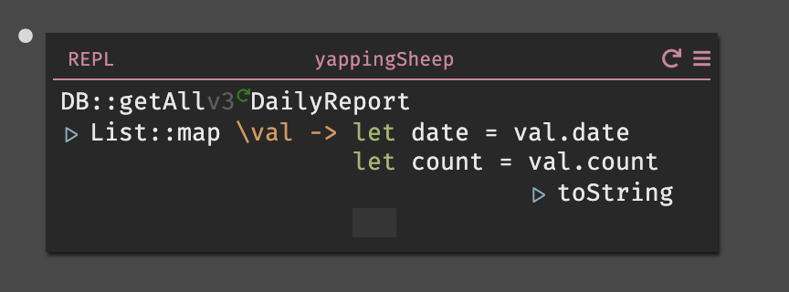
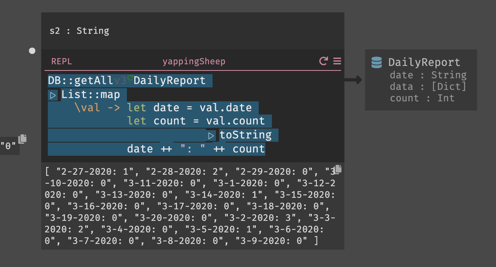
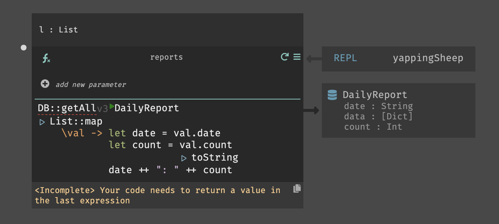

The best way to create a function is by write the code you want as part of your
handler, and then extracting the working code to a function. This ensures that
functions always have traces.

Let's look at creating a function to return a human readable summary of the number of reports for each day.

1. Start by creating a new REPL.

2. In the REPL, write `DB:getAll` to get the reports from the Datastore. Run the function using the play button.

3. Open a pipeline `|>` and pipe into `List::map`. We'll get the date and count
   for each item, using `let date = val.date` and `let count = val.count`.

4. Pipe `val.count` into `toString` (shift-enter on a selected area also pipes that expression).

5. Return `date ++ ": " ++ count` in the last line of the block.

6. We now have the code to generate our formatted report.

   Let's extract that code into a function. Select all the code within the REPL.

7. Type `alt-X` (`Option-x` on Mac) to open the command palette, then select `extract-function`.

8. The function will be created and replace the code.

9. Click on the function reference on the right hand side of the handler to go to the function and rename it.

Functions do not live on the main canvas. They are reusable and can be
called from any handler.

This function does not have any parameters. When you add parameters, the
editor will automatically create blanks for the arguments in all the
call-sites.

10. Go back to the primary canvas via the sidebar, the mini-map, or a reference
    on the right-hand-side of the function. Once back, create a new HTTP GET
    handler and call the function. This creates an API endpoint which returns
    the daily reports.

