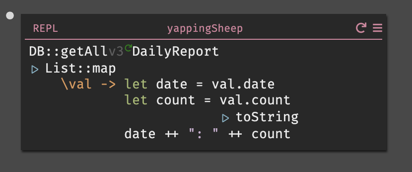
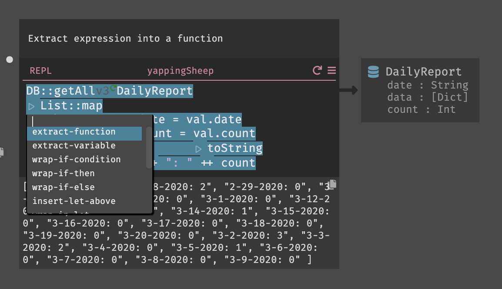

1. In Dark, the best way to create a function is by starting in a handler, and then extracting the working code to a function. This also means functions will always have a trace. Create a new REPL.

2. In the REPL, write `DB:getAll` to get the Daily Reports. Run the function using the play button. This gives us all the data, but it's a bit hard to read. We'll create a function that makes a human readable summary of the number of reports for each day.

3. Open a pipeline `|>` and pipe into `List::map`. We'll get the date and count for each item, using `let date = val.date` and `let count = val.count`.

4. Pipe `val.count` into `toString` (shift-enter on a selected area also pipes that expression).

5. Return `date ++ ": " ++ count` in the last line of the block.

6. To be re-use our formatted report, we can move it to a function. Select all the code within the REPL.

7. Type `opt-X` to open the command palette, then select `extract-function`.

8. The function will be created and replace the code.

9. Click on the function reference on the right hand side of the handler to go to the function and rename it.

Functions are re-usable and do not sit on the main canvas. It can be called from any handler. This function does not have any parameters. If the function did have parameters, when called, it would have blanks for the parameters & their types.

10. Go back to the primary canvas via the sidebar, the mini-map, or a reference (like the yappingSheep REPL). Once back, create a new HTTP GET handler and call the function. This creates an endpoint that contains our daily reports.

