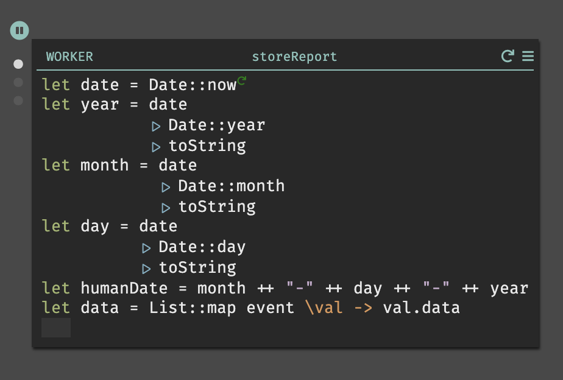
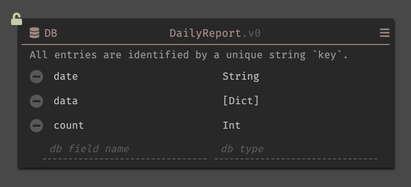
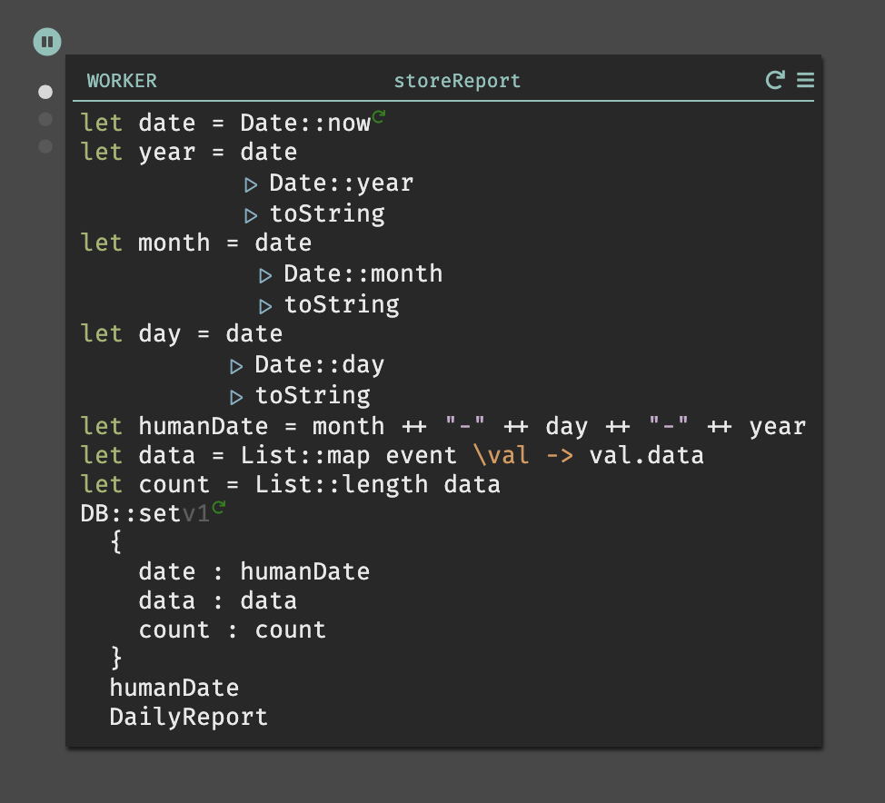

1. From the 404 section of the sidebar, hit the + button to create the `StoreReport` Worker. The Worker will already be named, and hovering over the white dot will show you the event triggered by your cron.

2. For the report, we're going to store our data by human readable dates (like 02-27-2020). First, we'll get the current date, and then get the pieces and reaggregate them.

3. Now, we'll want only the data associated with the request, not the times. We can use a `List::map` to operate on the keyword event.

4. To store these reports, we could use an external API but for the tutorial we'll make a second datastore that has the human date, the list of requests, and the count of requests for that day.

5. Then we can use `List::count` to see how many requests occurred in that twenty four hour period, add our report, using `humanDate` as the key.

6. Now, our first datastore will store each incoming request, and every 24 hours our CRON will run and our worker will store a report in our second datastore.