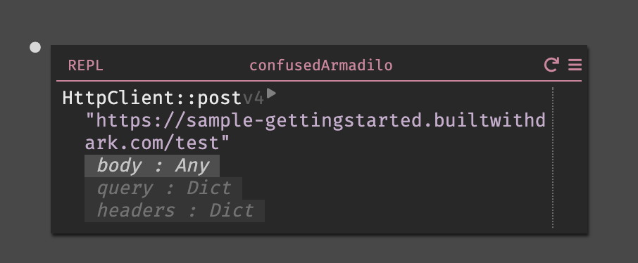
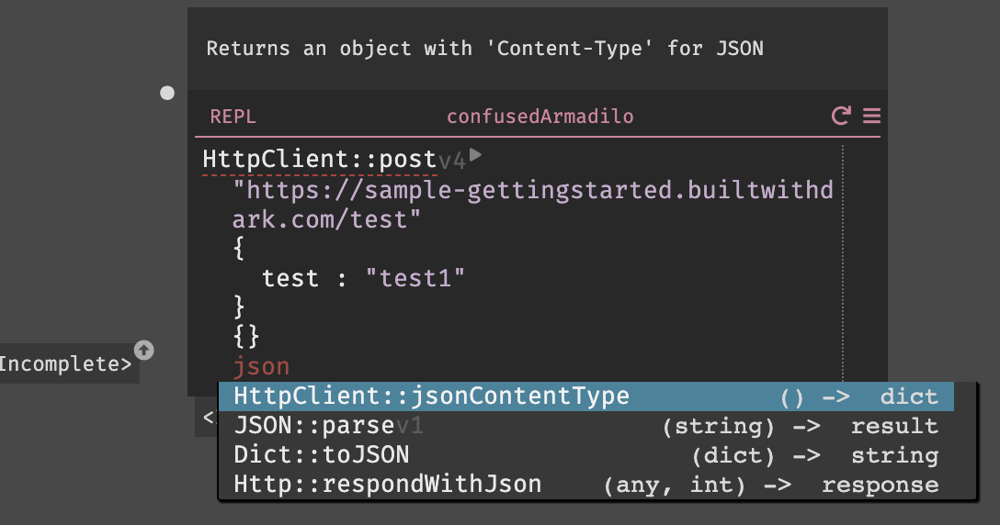
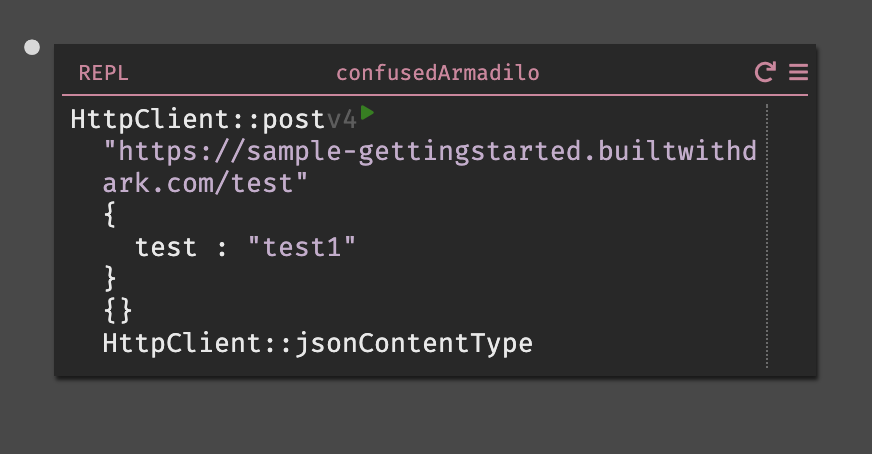
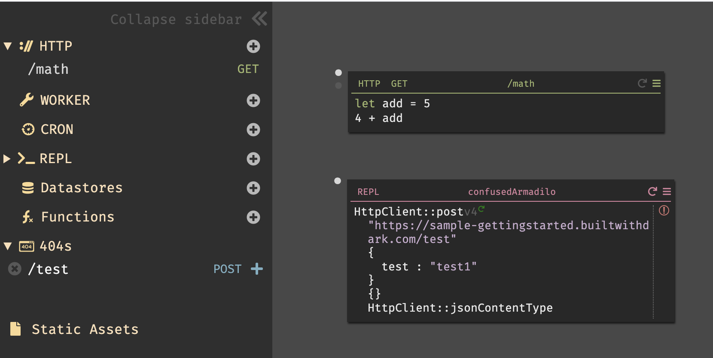

Concepts: REPLs, HttpClient Library, Play Buttons

1. Create a new REPL from the sidebar or the omnibox. This lets you write any code that you'd like to use for development.
2. Type "httpclient" in the REPL.

This will show you all the standard library functions for HTTPClient, their signatures, and their docstrings.

3. Continue typing, until you have httpclientpost. Dark will autocomplete, so you do not need to get the exact text (see I did not capitalize or type ::):

4. Hit enter to add the expression.

The expression automatically creates blanks for the four parameters that HttpClient::post takes, and when those are complete has a play button (grey triangle) that will allow you to run the expression from within the editor.

5. Let's call a new `/test` endpoint for the application we're developing. As we saw from the GET, our endpoints live at USERNAME-gettingstarted.builtwithdark.com, so enter a string like `"https://USERNAME-gettingstarted.builtwithdark.com/test"`.

6. Now we need to add the body, query, and headers. Add `{test:"test1"}` for the body, empty object for the query, and json content type for the header. The editor will support you:

- For the body type {, hit enter, then add the key and the value.
- For the query type {
- For the header type json and autocomplete will give you the formatted header.

7. Once we've filled in all the parameters, the play button next to the method (triangle) turns green, which means we can execute this code from within the editor.

8. Hitting play we receive a 404 response. This is because there's no /test endpoint on our canvas (yet!)

9. Since we called it, the endpoint also appears in the 404 section on the sidebar.

Congratulations! You've used your first REPL and written an HTTPClient expression.

