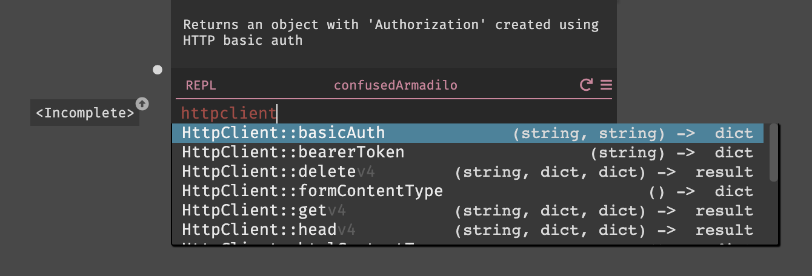
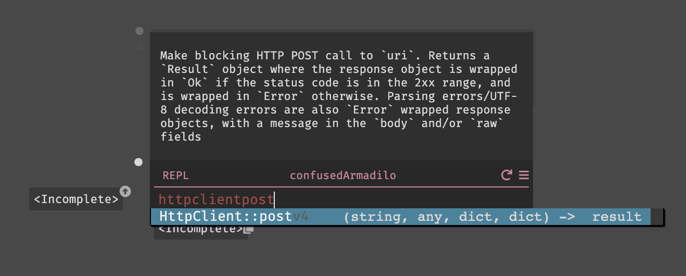
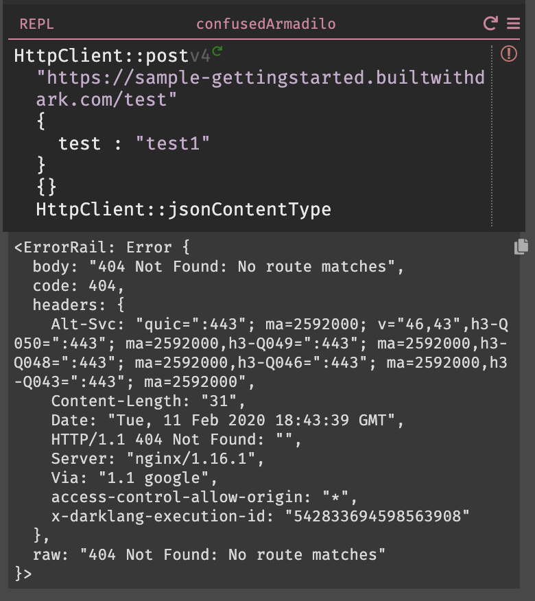

**Concepts:** REPLs, HttpClient library, Play buttons

REPLs in Dark are general-purpose coding blocks. They're typically used in the
way you might write a bash script (reusable tools), use traditional REPLs
(experiments and one-off commands), or admin dashboards (simple reporting).

We'll run you through creating your first REPL, experimenting with the
HTTPClient library to make API calls.

1. Create a new REPL from the sidebar or the omnibox (`Ctrl-K`/`Cmd-K`).

2. Type "httpclient" in the REPL (lowercase, no spaces)

This will show you all the standard library functions for HTTPClient, their signatures, and their docstrings.

3. Continue typing, until you have "httpclientpost". Dark autocompletes on substrings so getting the exact text isn't important:

4. Hit enter to add the function into the handler.

Dark automatically creates blanks for the four arguments that `HttpClient::post` requires. We display a grey play button beside the function &ndash; it will turn green when all the arguments are complete, allowing you to run the function from within the editor.

5. Let's call a new `/test` endpoint for the application we're developing. As we saw from the GET, our endpoints live at https://USERNAME-gettingstarted.builtwithdark.com, so enter a string like `"https://USERNAME-gettingstarted.builtwithdark.com/test"`.

6. Next let's add the arguments. The structured editor simplifies creation the arguments we want:

- For the body, we want to pass `{test:"test1"}`: type `{`, hit enter, then add the key and the value.
- For the query, we want an empty dictionary. Type `{`.
- For the header, we want the JSON content-type: type "json" and the autocomplete will offer you a function to use.

7. Once we've filled in all the arguments, the play button (▶️) next to the function turns green, which means we can execute this code from within the editor.

8. Hitting play we receive a 404 response. This is because there's no `/test` endpoint on our canvas (yet!)

9. 404s in Dark appear in the 404 section of the sidebar. We'll discuss that more later.

Congratulations! You've built your first REPL and called your first function in Dark.
