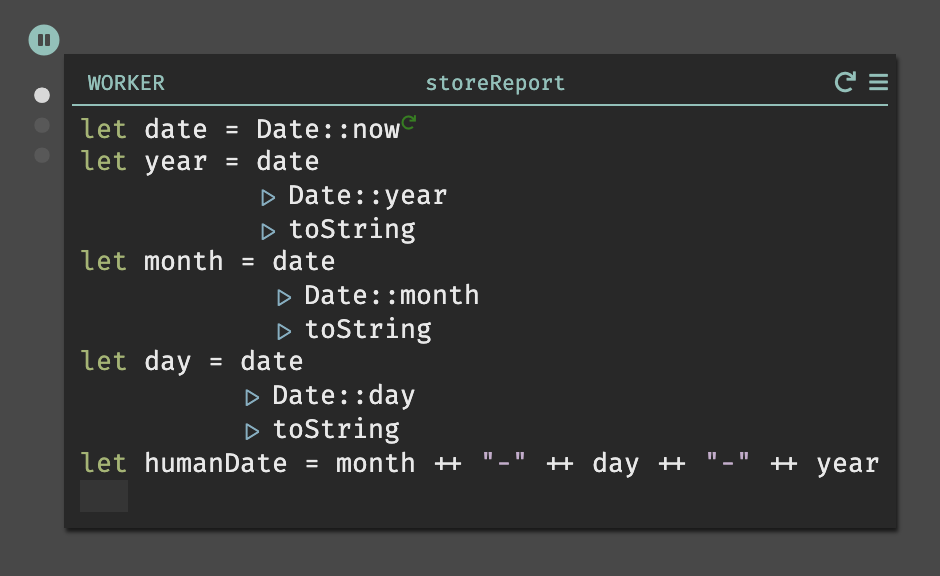

Workers process jobs in the background, idea for daily reports. They're also
commonly used for sending notifications and other asynchronous tasks that we
don't want to handle in HTTP requests.

If we were doing this for real, we might send the data to a 3rdparty API over HTTP. But for the sake of simplicity, let's just store the data into the `DailyReport` datastore.

1. From the 404 section of the sidebar, hit the plus (+) button to create the `storeReport` Worker. The Worker will already be named, and hovering over the white dot will show you the event triggered by your cron.

2. For the report, we're going to store our data by human readable dates (like `02-27-2020`). First, we'll get the current date, and then get the pieces and reaggregate them.

3. The `event` we received is not the exact shape we want. Let's process it using `List::map` to keep just the `data` field.

4. Make a second datastore with three fields: the nicely-formatted date, the list of requests, and the count of requests for that day.

5. To get the count, use `List::length`. Then we store it in the DB, using `humanDate` as the key.

6. Now, our first datastore stores each incoming request, and every 24 hours our Cron runs, sending the right reports to our worker, which stores a report in our second datastore.
