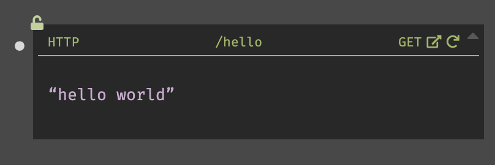
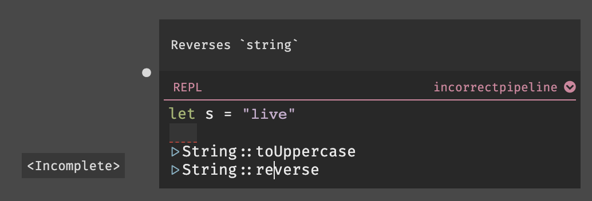
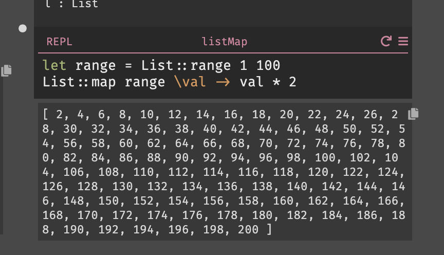
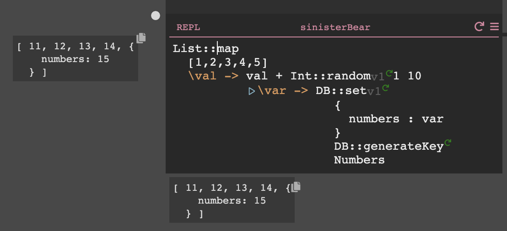
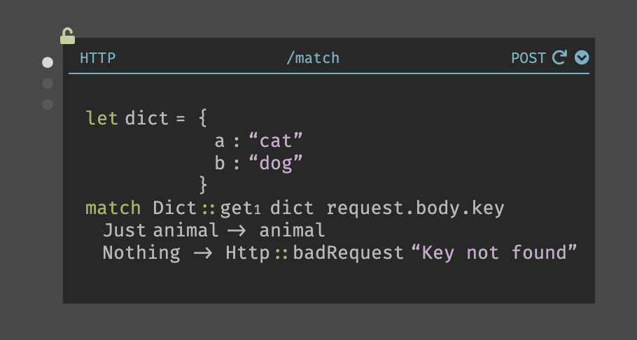
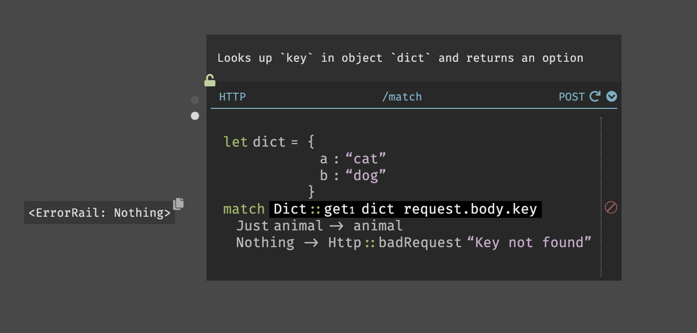

## Implicit Returns

We often get asked how to add more code to a handler. In the “hello world” above, there’s nowhere to enter code! This is mostly intentional - Dark works a little differently here than most languages.

Most languages, especially Javascript, are imperative: you tell it to do one thing, then do another thing. So whenever you have code, you can add more code below it to do more stuff.

Dark uses “implicit returns” (somewhat similar to Ruby, Coffeescript, Haskell and Rust). The value of an expression is that last value in that expression. So in the “hello world” example, you don’t write ‘return “hello world”’, just ‘“hello world”’ is enough.

Because of the implicit returns model, you write code differently. In JS you might write:

    if (myCondition) { 
    	s = 42;
    } else {
    	s = 56; 
    } 

In Dark, you’ll instead write: 

    let s = if myCondition 
    				then 42 
    				else
    					56

You can see some examples are shown here: [https://darklang.com/a/sample-returns](https://darklang.com/a/sample-returns)

A handler or function will return the result of the last expression within it. If the last expression is blank, Dark will return a 500 error.

If you have a statement where you only care about the side-effect (eg a **DB::set** or **emit** function) then you can put it on the right hand side of a **let _**:

When you hit “enter” at the end of such a line, it will automatically add the let for you.

### HTTPRespondWith

There's a set of functions that help form a response of a given type, ex [this handler](https://darklang.com/a/sample-returns#handler=1835918421) responds with text.

## Pipelines

### Pipelines/Threads

In Dark, we like to use pipelines to make code more readable. Pipelines are similar to method chaining in OO languages, and pipes in Bash.

Pipelines always pipe the previous value into the first parameter of the next expression.

Traditionally, you call functions with their arguments as parameters. However, that is often confusing and can be hard to read:

Using pipelines, you can perform a series of transformations on a value in order. Here, we start with the string "live" and pipe it to String::reverse to produce "evil". Then we pipe the result to String::toUppercase, producing the string "EVIL":

We find this simpler to reason about, though it can often take a few tries to understand it. This might help:

### How to Pipe

To start a pipeline, place the caret inside the expression you want to transform:

Then press “shift+enter”: 

And you can keep typing:

You can also place the caret at the end of the line, and press enter.

We currently default to piping larger expressions for convenience, but if you want to transform at a more local level, you can do that too, by selecting the expression you want to transform:

Then press "shift+enter":

And then you can keep typing:

You can also extend the pipe by pressing Enter at the end of the line with a pipe on it.

### Tip

Look at the indentation to see what is being piped at a glance. A common mistake with pipelines is introducing them at an unintended "level". For example, here the piped value is the let expression as a whole, but the author intended to pipe the expression bound to the variable s:

*To view the live code provided in the examples above, visit [https://darklang.com/a/sample-pipeline](https://darklang.com/a/sample-pipeline).*

## List::Map & Lambda

Dark does not have a for-loop, instead it has “List::map.” This allows you to do something to a collection of objects in a list.

List::map takes two parameters. In this case we are passing in a list of integers, and then there’s a block where we can choose what to do to each of them.

In this case, we multiply each value by two:

If we wanted to do something involving subsequent list items, we can use a List fold (in this case we pipe the output of our previous list into list::fold), resulting in a return value of 10,100:

**Known bug:**

Right now, if you use a map with a function that has a side effect (like Int::Rand) the analysis will show you the impact of the *last* version of the side effect as though it was used for all of them. This is an analysis bug (you are actually getting a random int each time).

List map with no side effect:

List map with a side effect, appears to use the same Int::random each time:

List map with side effect, discrepancy between analysis and values stored in DB:

## Match

The match expression is used to destructure complex types (it can be used similarly to switch statements in other languages). At the moment, it only supports the Option type (Just and Nothing), but we will soon be adding a Result type for error handling, as well as user-defined types.

Here’s an example of using a match expression with a dictionary lookup.

Note that you will need to take the value off the error rail first, or you will get this ([more docs on the error rail](error-handling):

## Language Versioning

You can see that many standard library items are labeled “3” or “1” in the editor. These refer to the version of the function. When you start a new canvas, you will always have the latest versions. If we upgrade, you’ll have the choice to do so, but can continue to use the old ones.

## Dictionaries and Objects

To initiate a dictionary, call Dict::empty. You may add keys with Dict::set.

To get values from a dictionary, use Dict:get.

We will soon be deprecating our objects ( { } ), and splitting them into two concepts: record types and dictionaries. For now, you should consider curly braces to mean records, and use Dict:: functions for supporting things like allowing non alphanumeric characters keys.