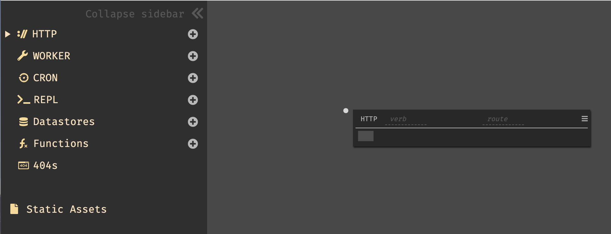
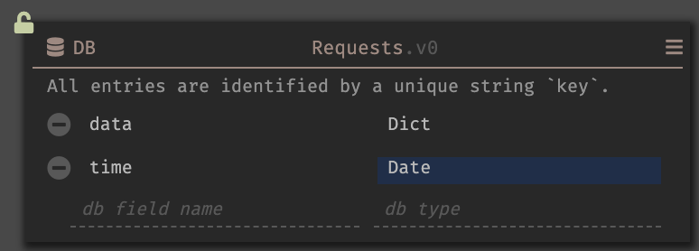
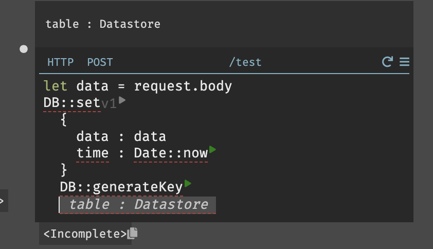
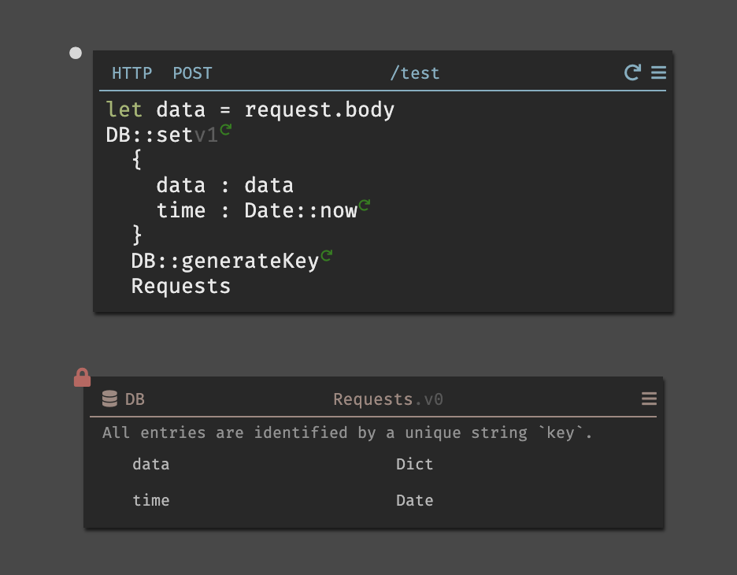
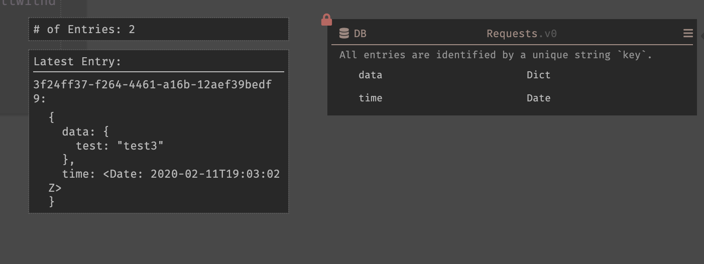

## Tutorial: Getting Started

Hello!

Welcome to Dark. We highly recommend trying this getting started project to setup an API + data storage first - it will get you through all the key concepts including Trace Driven Development, Live Values, and the Interactive Editor.

## Canvas

When you open Dark, you'll be able to access any canvas in your username by opening it in the browser (darklang.com/a/USERNAME-CANVASNAME). In this case, use darklang.com/a/USERNAME-gettingstarted. Each handler we'll build is replicated in [https://darklang.com/a/sample-gettingstarted](https://darklang.com/a/sample-gettingstarted), though we recommend writing the code yourself instead of copy pasting.

The canvas allows you to create each major component in Dark from the sidebar, or from the omnibox (click anywhere on the screen or hit cmd-k).

## Your first API Endpoint (HTTP GET)

**Concepts:** Structural elements, blanks, implicit returns, traces.

1. Create a new HTTP endpoint from the omnibox or sidebar.

2. Specify that the verb is "GET" and the route is "/math."

3. You can now write any code in the blank. For instance, write 4.

This results in an API that has the return value of 4. Click the hamburger in the upper right and select "open in new tab". Then, you see your API running in production.

4. Go back to Dark to edit your code. Add + 5 to the end of the code and leave your cursor in line.

- The "9" at the bottom shows you the return value for the handler (what your API will now return if you open it in the browser).
- The "5" on the left is showing the result of the expression where the cursor currently is (in this case, 5). This isn't very useful when it's an integer, but if it's a variable it will show you the result of the variable.

5. Mouse over the white dots on the left. These dots are each time you have opened in the browser (if you re-open the tab from the hamburger, you'll see more appear).

Congratulations! You've shipped your first Dark API endpoint.

## Your first REPL

Concepts: REPLs, HttpClient Library, Play Buttons

1. Create a new REPL from the sidebar or the omnibox. This lets you write any code that you'd like to use for development.
2. Type "httpclient" in the REPL.

This will show you all the standard library functions for HTTPClient, their signatures, and their docstrings.

3. Continue typing, until you have httpclientpost. Dark will autocomplete, so you do not need to get the exact text (see I did not capitalize or type ::):

4. Hit enter to add the expression.

The expression automatically creates blanks for the four parameters that HttpClient::post takes, and when those are complete has a play button (grey triangle) that will allow you to run the expression from within the editor.

5. Let's call a new `/test` endpoint for the application we're developing. As we saw from the GET, our endpoints live at USERNAME-gettingstarted.builtwithdark.com, so enter a string like `"https://USERNAME-gettingstarted.builtwithdark.com/test"`.

6. Now we need to add the body, query, and headers. Add `{test:"test1"}` for the body, empty object for the query, and json content type for the header. The editor will support you:

- For the body type {, hit enter, then add the key and the value.
- For the query type {
- For the header type json and autocomplete will give you the formatted header.

7. Once we've filled in all the parameters, the play button next to the method (triangle) turns green, which means we can execute this code from within the editor.

8. Hitting play we receive a 404 response. This is because there's no /test endpoint on our canvas (yet!)

9. Since we called it, the endpoint also appears in the 404 section on the sidebar.

Congratulations! You've used your first REPL and written an HTTPClient expression.

## Your second API endpoint & first Data Store

We can use the trace of that HTTP request to build the endpoint. This is Trace Driven Development.

1. Hit the + button in the side bar to create the HTTP endpoint. The verb (POST) and route (/test) will be set for you.

2. Hover over the white dot on the left hand side. Here, you'll see the full body of the incoming trace from when you posted to the endpoint from the REPL, including the body.

3. Let's work with the request directly and save the incoming body to a record by typing `let data = request.body` again. The autocomplete will assist with the fieldnames.

4. Let's put this in a datastore. Like our HttpClient library, typing "DB" in the blank will pull up all datastore functions.

In this case, we want db::set, which takes three parameters.

5. Now let's make our datastore. From the sidebar or the omnibox, create a new datastore called "requests" and give it two field names.

All datastores in Dark are key-value based and use keys as unique identifiers for the record. For instance, a possible set of records with keys in the above datastore would look like this:

    {
      key1: {
              data: {
                      test: "test2"
                    },
              time: <Date: 2020-02-11T18:54:39Z>
            },
      key2: {
              data: {
                      test: "test1"
                    },
              time: <Date: 2020-02-11T18:54:43Z>
            }
    }

6. Now that we have a datastore, let's finish our post endpoint.

The first parameter is the record we're inserting. This will match our schema of date & time. In Dark, all fields must be included for DB::set. We'll insert our data from above (seeing the live value to the left) and the Date::now function to get a time.

7. We'll need a unique key for each object. In this case, by typing db, we get the built in db::GenerateKey function.

8. Lastly, we'll use the autocomplete to add our datastore, Requests.

9. To run the DB::set operation on our existing trace, we first need to run the two functions with side effects (db::generateKey and Date::now) by hitting the play button. After hitting those two play buttons, DB::set will be green:

10. Finally, hitting the play button for DB::set will insert the record into the datastore, and lock the schema.

Try it out:

- Change your REPL to say "test3" instead of "test1" and then re-run the request.

    

- A new trace dot will appear on the HTTP Post handler.

    

- The record will be added to the datastore.

    

Congratulations! You now have your first Dark application: an API that stores requests into a datastore.
