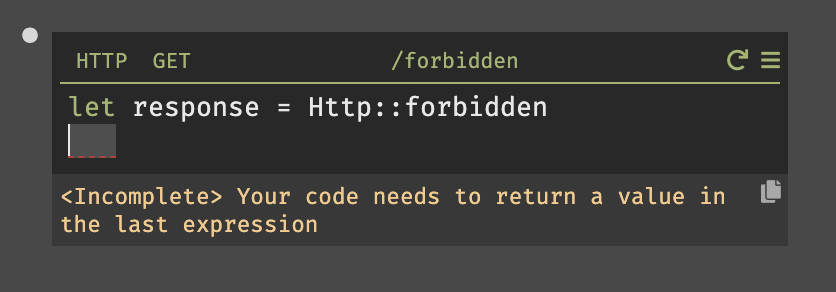

## Overview

The foreign function interface for Dark is REST APIs. We have server side functions (HTTP::) and client side functions (HTTPClient::).

### HTTPClient Verbs

`HTTPClient::` supports the core verbs: GET, POST, PATCH, PUT, and DELETE, as well as OPTIONS. Each takes 3-4 parameters: uri, query, body, and header. GET, DELETE, and OPTIONS do not take a body.

There are build in header functions for commonly used headers, including Auth (`HTTPClient::basicAuth` and `HTTPClient::BearerToken`) and content types for plain text, JSON, HTML, and form. To combine two headers, use `Dict::merge`.

For a custom header with "-", use `Dict::set`. Records do not currently support "-".

### HTTP

`HTTP::` Provides a library of formatted responses to external HTTP calls. Setting `response=HTTP::` will result in a formatted record, but it will not be sent to the client unless it is returned by the handler.

The live value beneath the handler will show the return value.

The response can be used without being bound to a variable.

There are also HTTP functions that can be used to support these responses or used in a header, for instance `HTTP::setCookie`.

