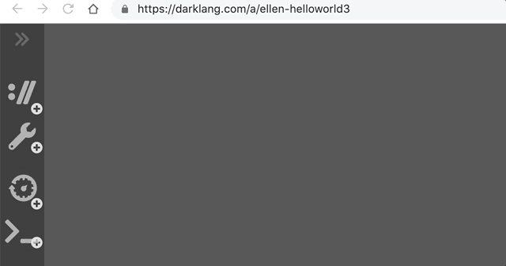
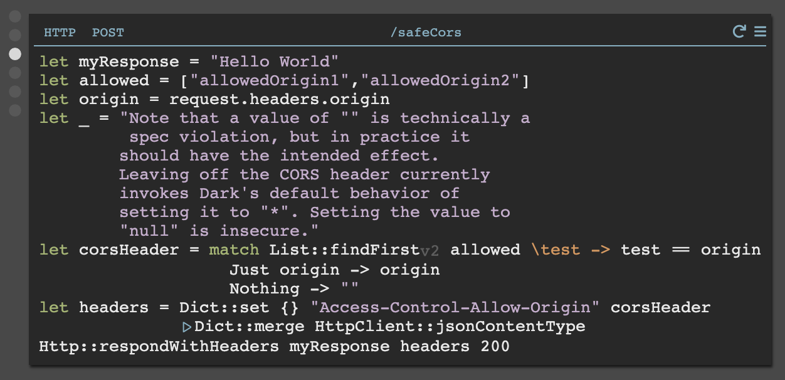

Dark is a language and framework for building web backends: REST API endpoints,
asynchronous background workers, scheduled jobs, and persistent storage.
Dark's framework is tightly coupled to the infrastructure, and as you write
code you're able to develop from real incoming requests/traces.  Dark is *only
supported* for Chrome *without* browser extensions. (Other browsers do not yet
have all of the features we need. Browser extensions often interfere).

## Hello World

## Learning Dark

Above, you can see the simplest app in Dark: the hello world app. It shows
starting with an empty canvas, creating a HTTP endpooint (GET /hello), running
code ("Hello world") and opening that page.

### Support

If you need support, the [Dark Community Slack](https://darklang.com/slack-invite) is the best place for front-line support. We’re very responsive during the day, and often responsive at all hours.

### Next steps

- Go through "your first dark application", a guided tutorial to build your first backend app.
- Read through the concepts that make up Dark, discussiong the components of an app, Trace-Driven development, and more.

## Additional Information/Advanced Topics

- Collaboration: Works like Google docs. If you need to share a project with another user, please request an organizational canvas via Slack.
- CORS: if you’re interested in setting CORS, we have internal tools do that! We're happy to do it in real-time with you to make sure it works. Drop us a note in Slack and we can get you set up. If you'd prefer to try it yourself, here is an example:

## Known Issues

- Large handlers cause performance problems.
- Recursion does not work well yet.
- Some quirks exist around international keyboards. Please report all instances of this in the Community Slack. In the short-term, you may need to switch to an English keyboard.
