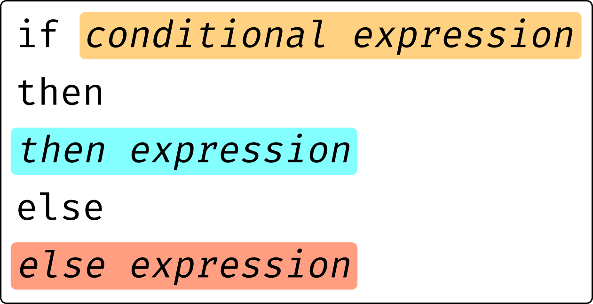
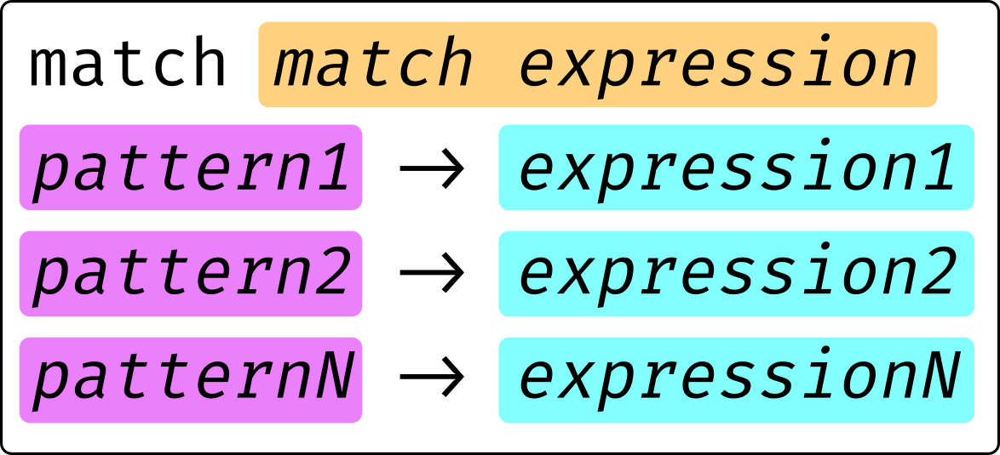
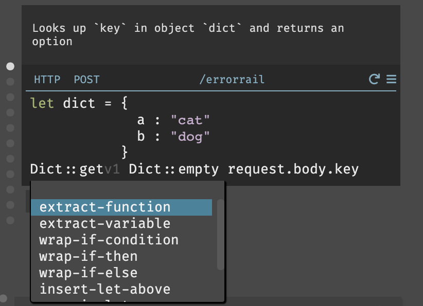

_Note: for now, Dark is only supported for Chrome with browser extensions disabled._

At heart, Dark is an expression-oriented programming language. This aspect of Dark enables powerful features like live values and trace-driven development. This section introduces a simple way to think about the structure of Dark programs within the editor.

When writing code in Dark, you are building up expressions, relying heavily on autocomplete.

## Blanks

A blank expression acts as a placeholder where you can type to create a different expression. The value of a blank expression is `Incomplete`, because it needs to be completed in order to be useful.

Once a blank is filled in, it won't be a blank anymore:

2 is an integer expression with the value 2.

## Types of Expressions

In addition to blanks, there are also many other types of expressions.

Atomic Expressions include:

- Integers (whole numbers like `42`)
- Floats (numbers like `1.5`)
- Strings (text in double quotes)
- Bools (true and false)
- null

There are also more complex expressions:

- Lists
- Dicts
- Records
- Functions
- Conditionals
- Matches

For more on the language features of each type of expression, visit the [Language Overview](language). Examples of how these expressions are used in the editor are below.

## Nesting Expressions

Expressions in Dark are nested. For example, a multiplication expression is a compound expression with two sub-expressions as operands:

Filling a blank with an expression with sub-parts introduces a new blank for each of them.

In the expression 2 \* 3, these sub-expressions are filled with the expressions 2 and 3:

The value of the expression `2 * 3` is `6`. This is equivalent to saying `2 * 3` evaluates to `6`.

Since `2 * 3` is an expression, it can itself be a subexpression of a compound expression. Consider the expression `1 + 2 * 3`, which has the value `7`. It is a compound expression with a binary operator `+` and two subexpressions as operands: `1` and `2 * 3`.

### Let Expressions

This nesting of expressions applies to all parts of the language, not just to mathematical expressions. When defining a variable in Dark, you use a let expression, which has 3 parts: a variable name, a value (an expression!) bound to that variable, and a body (another expression!) within which you can use the name as an expression to stand in for the value:

Here's a let with 3 blanks in Dark:

### Conditional Expressions

If expressions have 3 parts: a boolean conditional expression and two branches, a then and else expression. The value of the conditional expression determines whether the then or else expression is evaluated. The value of the evaluated branch becomes the value of the if expression as a whole.

Here's a conditional in Dark:

### Match Expressions

`match` expressions provide conditional evaluation of one or more expression branches. They may also introduce new variable bindings. Every match has a single value expression that is evaluated once and matched against one or more patterns. The first pattern that matches the evaluated value indicates the expression to evaluate. The value of the evaluated expression becomes the value of the match as a whole.

### Pipelines

Pipelines are a key part of the Dark language. They allow you to create a chain of expressions, where each chain is an input to the next expression in the sequence.

To start one, select the code
that has the result that you want to pipe, and hit `shift-enter` or type `|>`.

## Partials (Partially Completed Expressions)

While you are typing or deleting, you'll often see partially completed expressions like this:

The text in red is the partial, and the grey text behind it indicates what was there before. Note that partials evaluate to whatever was there before:

...until you complete them from the autocomplete:

## Refactoring and editing code

### Undo/redo

Dark supports unlimited undo/redo in a single element. Undo with `Ctrl-Z`/`Cmd-Z` and redo with `Ctrl-Shift-Z`/`Cmd-Shift-Z`.

### Copy/paste

You can copy/paste selections, which is often used for refactoring.

It may be helpful to note that copy/paste only works in Dark between handlers
at this time. Copying JSON from an external source will paste into your
handlers in Dark, but if you write code in the Dark language in your text
editor of choice, that code will not paste. We hope to improve this experience
in the future.

### Command Palette

If you’re looking to do something that is not immediately available, chances are it’s in the command palette (accessed by hitting `ctrl-\`).

This includes the common refactoring tools:

- Extract a function or variable for re-use
- Create a type
- Wrap the current expression in a let (insert let here)
- Insert a let-expression above this one
- Wrap an expression in an if, if-then, or if-else
