This tutorial will first teach you how to create a simple todo list app in Dark. Then you will learn more other core concepts of Dark, by extending the app allocate tasks based on the time you have available available each day.

## What you'll learn to
- Create HTTP handlers from 404s
- Create parameterize HTTP handlers
- Create DB, insert entries, update entries, and query
- Use a REPL to insert an entry into a DB
- Add code to existing handler
- Get data from related datastores
- Spin data into async tasks
- Set up CRON job
- Call a 3rd party API
- Send a Twilio text with Dark

## What you'll need

First clone the frontend of our [todo list project](https://github.com/9ae/okitoki/tree/dark).

`git clone -b dark git@github.com:9ae/okitoki.git`
Be sure you are cloning the dark branch.

This app is written in vanilla Javascript, so no need to know any frameworks.
In fact is is setup in such a way you shouldn't have to touch most any of the code at all.

One thing you will need to do is change the go to `src/Dark.js`.
In the first like it saids `const host = "https://sample-todo.builtwithdark.com"`, which is the fully complete project. You'll want to change it to your own dark project url.

After that hit save, and run `npm run build`. And just open the file `docs/index.html` in your preferred browser of choice. It might be useful to keep your browser's debugger console open, so you can see failed request turn into successful requests.

## A Simple todo list
Let's start simple! Ignore everything to the right, and we can focus on the tasks in the left-most column.

### Handling a request
Here you will create a task, save it in Dark.

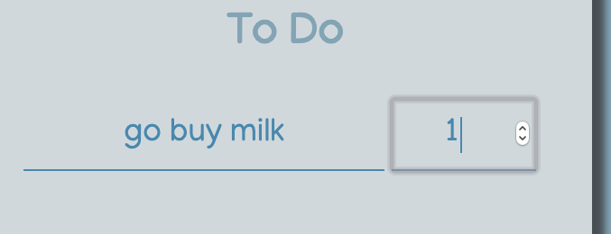
To create a task just enter some text both fields, hit enter or click away.

It will turn into a card, and what you also notice if you have your console open is that there's a 404 in the network request, when it tries to call `POST /task`
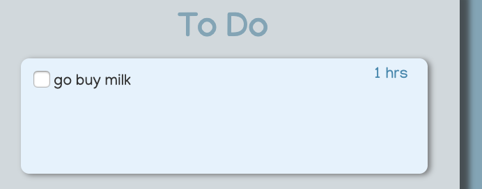

Go to the Dark canvas where you are doing your project, and you can find this request.

Click on *+* icon to create a HTTP handler populated with data from your 404 request.

Now if you create a request again from the frontend, you'll get a 500 instead of a 404.
Before we can properly return a OK response, we must first setup a place to store our DB.

### Creating Task datastore

Create a datastore named 'Task' with the following schema:
[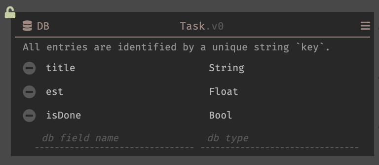](https://darklang.com/a/sample-todo#db=1690936501)

Now we are ready to populate the datastore!
Go back to your `POST /task` code
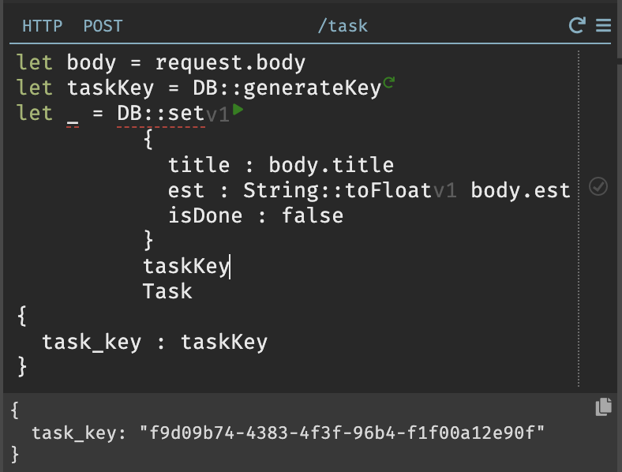

DB::generateKey creates a UUID-like string key that will be used to uniquely identify the entry. Your key can be any string, as long as you keep it consistent. You can learn more about [key-value datastore](/dark-backend-components#persistent-datastores).

Now if you try to create a new task again. No 404s nor 500! We have 200, success at last!

### Marking tasks as DONE

If you click on the checkmark on your newly created tasks, you'll notice another 404.
But we are not going to create it the 404 this time, you'll learn another way to create HTTP request handlers.

Launch your omnibox (Cmd+K or clicking any blank space on your canvas).
Type in `/task/:key/done` and select 'New HTTP handler'.
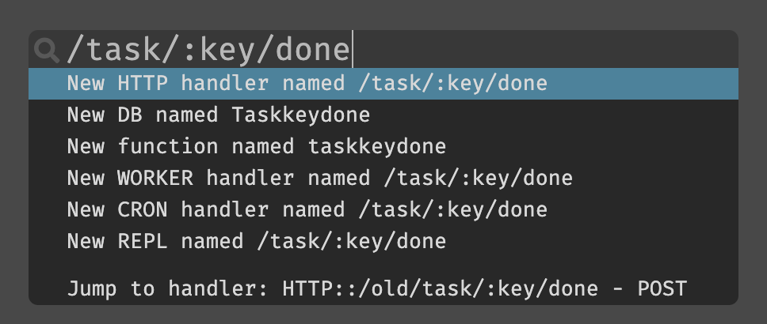

This method allows you to create parameterized paths, and these will be exposed as available variables in your autocomplete.

Now you can update your task and mark it as complete.

**You have completed your simple todo list app!**

## Creating DayLists & Loading data from Dark

Now you probably noticed that once you refresh you webapp all the data goes away. That is because we don't have anything to initially load your data from Dark. Let's work on doing that!

### Create a List datastore

In this project, we can consider all tasks belonging to lists, even our tasks on the far left that we just created, essentially belongs to an "unsorted" list. Let's create a datastore for that.

[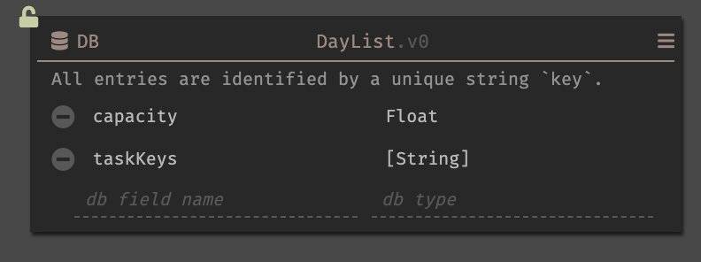](https://darklang.com/a/sample-todo#db=81292856)

Sometimes you might want to manually prepopulate some data. To do this create a REPL.
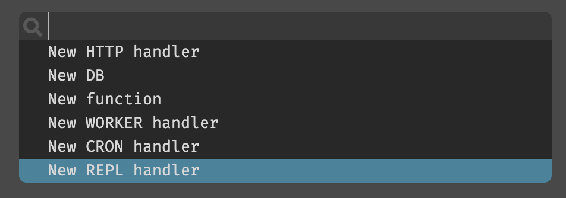

[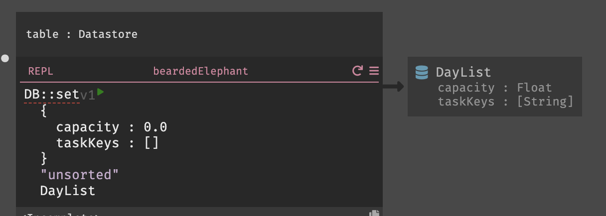](https://darklang.com/a/sample-todo#handler=965765956)

Since DB::set is an impure function, click on the play button to execute. This will insert an entry into your DayList datastore with the key "unsorted".

Naming can be hard, we don't want to be held up by trying to name your one off code. Unnamed REPLs have auto-generated names, they are inspired by the animals of St. Louis Zoo. Cute at first, but with too many REPLs in your project, it can easily become a real zoo of confusion. You can rename your REPLs to more action descriptive names, by double clicking into their names.

### Update POST /task

Now let's insert all newly create tasks into the unsorted list. Update your */task POST* endpoint, by adding the selected code.

[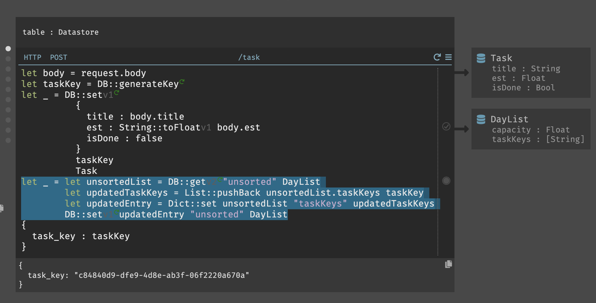](https://darklang.com/a/sample-todo#handler=2003288259)

Now if you add a new task it will load be added to the unsorted list.

### Load tasks on initialize

Create a new endpoint */tasks GET*

Here what we want is to first the DayLists and then literate trought the taskKeys to get each task associated with the list.
[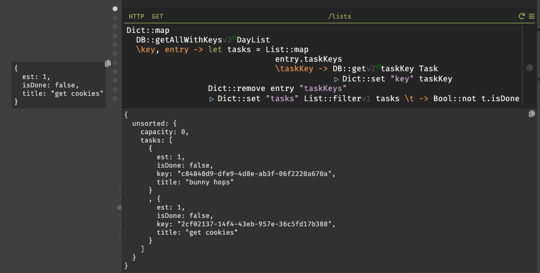](https://darklang.com/a/sample-todo#handler=1439624407)

Now if you refresh your page the last task you added should appear on the unsorted section in the left.

### Creating POST /list

Making your days list (I recommend making one that is today, for easier testing during the CRON jobs later). If you fill in the date field and the capacity field and tab/click away, it should send a request to dark which for now is a 404.

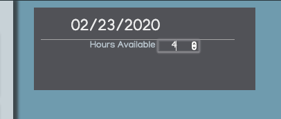

We will do something very similar as we did for `POST /task`, and create this HTTP handler by recovering it from the 404.

[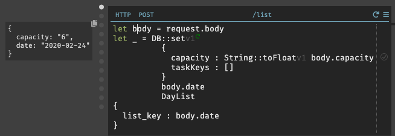](https://darklang.com/a/sample-todo#handler=714441098)

You will notice here, that for DayList entries instead of generating a key, we can use the date string as a key.

Now if you try to create a list again, you should get a 200. And if you refresh your page, the newly created list will also appear.

## Allocating Tasks to Lists

Now for the fun part!

We want to be able to update our datastores, when we move tasks from the unsorted list to a day list, and between the lists too.

Let's create an endpoint to handle moving tasks between lists. From the omnibox make `task/:key/move` and make it a `POST` endpoint.

If you drag a task from unsorted into your date list, you'll probably get a 500 because we haven't filled out our handler with code yet. 

In this request we want to do two things, remove key from one list and add it to another.

For each, we will retrieve the list by key, and update taskKeys accordingly.
- To remove, we use List::filter and keep all keys that is not the key of the task that was just moved.
- To add, we simply use List::pushBack to add the new task key.

Now that we have most of it done, have some fun! Create tasks, create day lists, drag them around!

## Deleting an entire list

Now not only do we want to delete the list from the database, we also want to delete tasks associated with that list. This may take a while, any procedure that may take time and potentially timeout, should be sent to WORKER which handles your code async. This way freeing the main execution engine to return an early result.

First create a new endpoint `/list/:key DELETE`.

[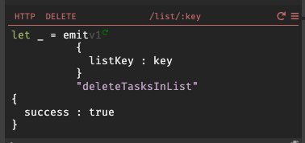](https://darklang.com/a/sample-todo#handler=1109242937)

Now it's time to create a WORKER named "deleteTasksInList".

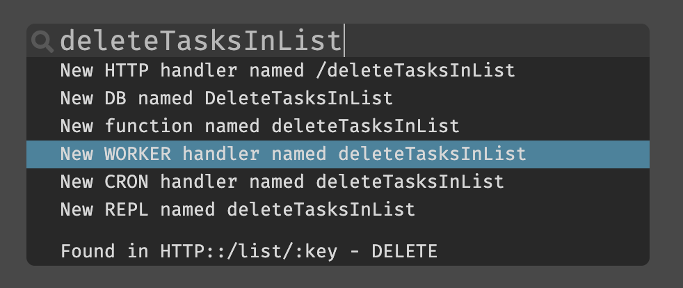

Like `request` is an available variable for HTTP handlers, `event` is an available variable for WORKER handlers by default.

## Sending Daily reminders

This is real awesome! But Dark is so much more than simple data storage.

Won't it be nice to send every morning greeting us and prepping us for our upcoming day. 

### Getting tasks from today's DayList

First, let's create a function to just return YYYY-MM-DD portion of a DateTime string.
[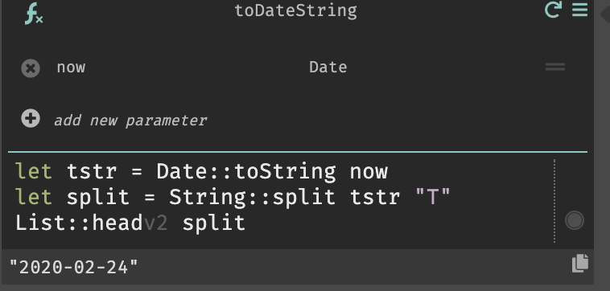](https://darklang.com/a/sample-todo#fn=516794171)

Now create CRON job that runs daily.

### Calling an external API
Now that's alot of pressure just reminding you with shit you have to do. Let's soften the blow with an inspiration quote. For this we will use: https://quotes.rest/

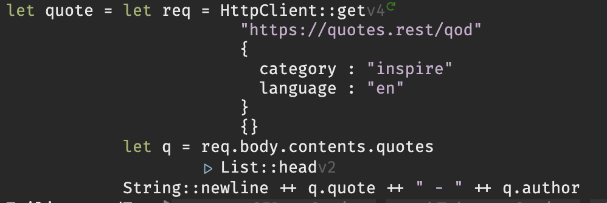

### Using the Twilio function to a text message

Awesome, let's put it all together.

[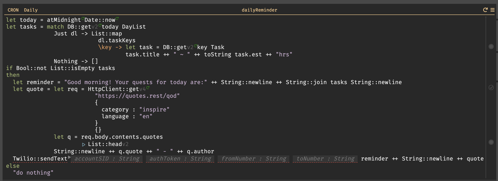](https://darklang.com/a/sample-todo#handler=1452395358)

You don't have to use Twilio, you can also learn this into a [slack bot]().