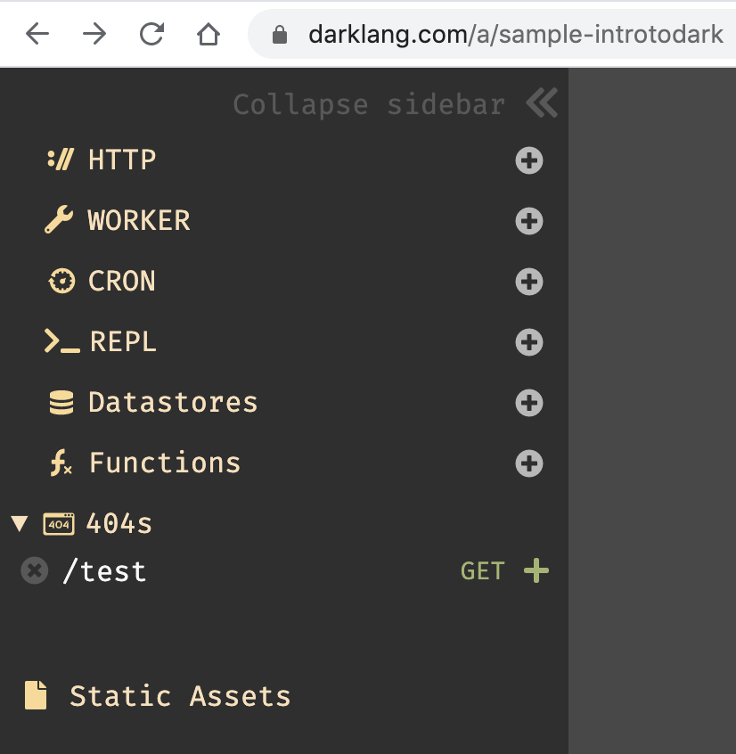
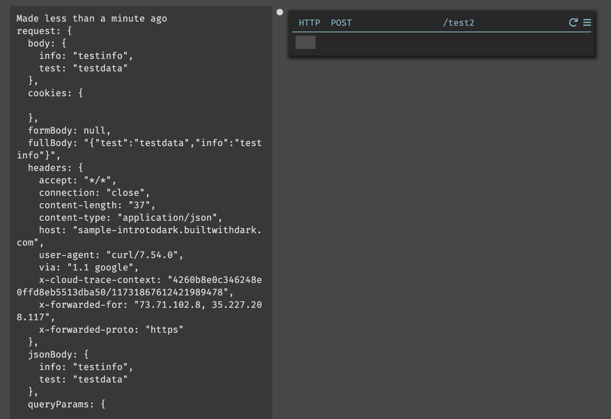
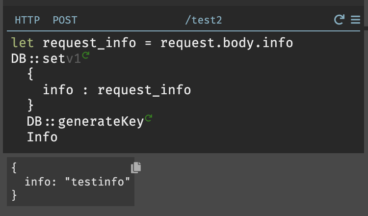

Dark flows from end user experience through to the backend components. If you would like to see any of the code from this document, the sample canvas that goes along with it is: [https://darklang.com/a/sample-introtodark](https://darklang.com/a/sample-introtodark#handler=1175293748)

## Sending Requests to Dark

Send requests to Dark *before writing code*. There are several ways to do this:

1. Build your frontend or mobile app first and point your API endpoints at Dark (you can host your frontend on Dark by [uploading your static assets](static-assets.md) via CLI).
2. Use another platform that makes requests via REST (Slack, Twilio, Shopify) and use Dark with existing webhooks or calls.
3. **Use postman, curl, or another tool of your choice to send test data in the correct shape to your API endpoints.** This is the easiest way to get started, and you can try it out by following the rest of this doc.

### Using Browser & Curl for Requests

#### GET Requests

- Open your canvas (darklang.com/a/USERNAME-CANVASNAME).
- In another tab, visit username-canvasname.builtwithdark.com/test (ex: [https://sample-introtodark.builtwithdark.com/test](https://sample-introtodark.builtwithdark.com/test)).
- Go back to Dark and check in the 404 section.

You’ll be able to create the endpoint and see the full request (including any query params if you add them - i.e. test?name=ellen). Each request shows up as a trace on the left hand side of the handler as a grey dot, or a white dot when selected.

You can work with the selected trace. In this case, the handler is set to return the "accept" field within the header. If the caret is in the text of “request” you’ll see the full request, in “headers” the full header, and in this case the caret is in "accept," which means we see only that field to the left.

If you do not select a trace, you’ll see spinners for all live values.

One current limitation is that you can only write code for existing traces (trying to access something that doesn’t exist will not allow you to write the code). We’re working on it.

#### POST Requests

Open terminal and curl:

    curl -X POST -H 'Content-Type: application/json' https://username-canvasname.builtwithdark.com/test2 -d '{"test":"test data","info":"test info"}'

When you create the route you’ll see the recent traces as white dots on the left. You can select a given trace by clicking on it and then you’ll see all expressions evaluated for that request.

Similarly to the get request, you can work with the real data from the trace. In this case the handler shows "request.body.info."

You can select which trace you are using when evaluating your code. Below, there are three recent traces, and we’re seeing the value of “info” for the most recent.

## Live Values & Play Buttons

Once you have requests/traces, you can use them while writing code.

When you write code, if you put your cursor into the code, you will always see the result of that code for the selected trace on the left hand side. These left-hand-side values are called "live values."

As seen above with “testinfo,” expressions will automatically show you their values to the left if they have no side effects. Below, we see the result of the addition:

When an expression does have side effects (like changing a value in a datastore or calling an external API) it will have a green “play” or “replay” button that allows the developer to *choose* to run it for the current traces.

In our earlier request, if we saved "request.body.info" to the variable "request_info," we could then choose to insert it into a datastore. In this case, there’s a play button to generate a new key, and a second one to insert the information:

Once you play the **DB::generateKey**, you can see the resulting key, and choose to play the **DB::set** expression:

When you play **DB::set**, you can see the record that was inserted:

### Replay Entire Trace Button

If you wish to replay the entire trace, you can use the “replay” button next to the hamburger menu in the upper right of the handler.

## Return Values

When on a handler, you’ll also see a live value at the bottom that corresponds to the value a handler returns. Dark has implicit returns (more on this in [Functional Aspects of Dark](functional-aspects)).

